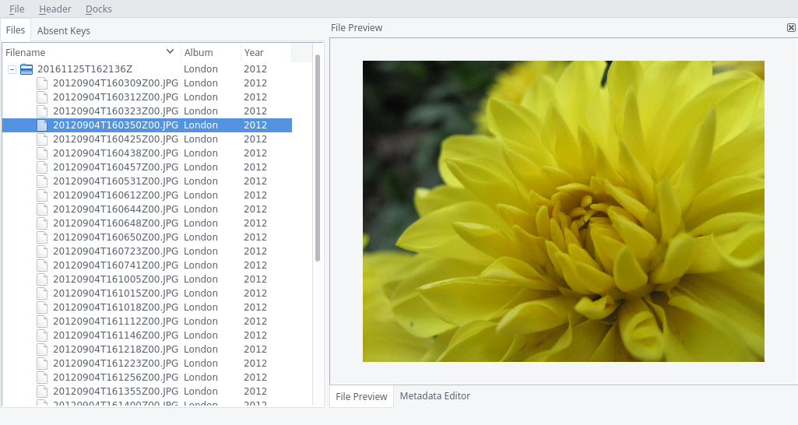
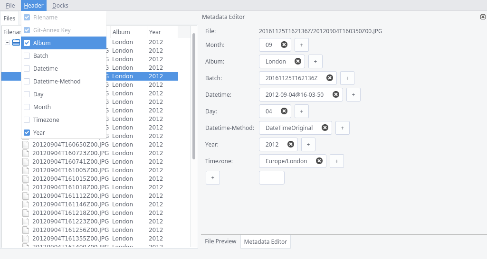
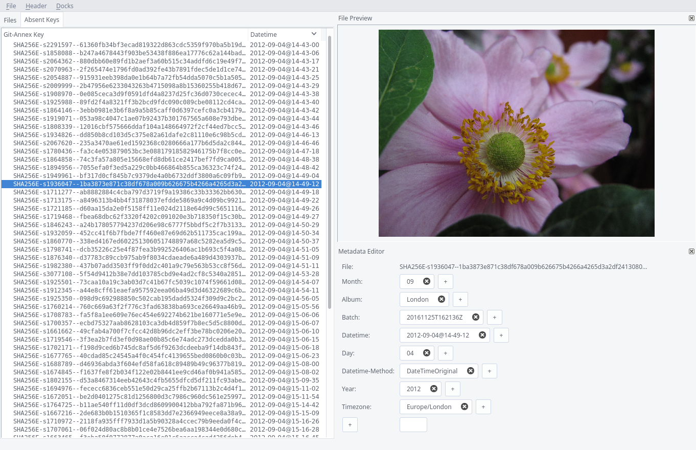
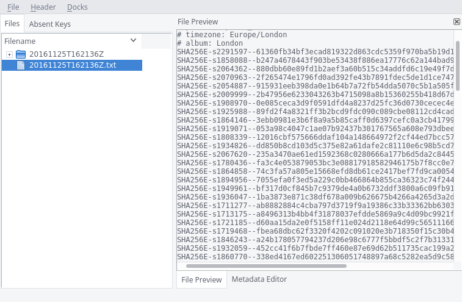

======================
Git-Annex-Metadata-Gui
======================
A graphical interface to the metadata functionality of git-annex_.

.. _git-annex: https://git-annex.branchable.com/

Requirements
------------
- Python 3
- git-annex-adapter_
- PyQt5

.. _git-annex-adapter: https://github.com/alpernebbi/git-annex-adapter

Usage
-----
::

    $ git-annex-metadata-gui [/path/to/repo]

Screenshots
-----------

